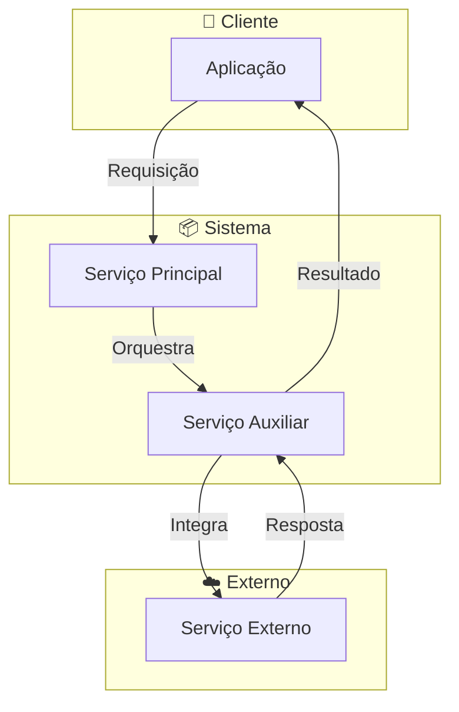
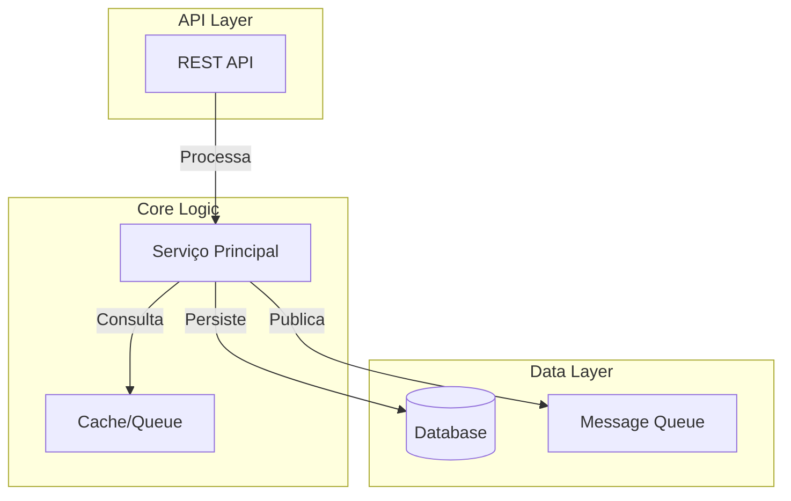
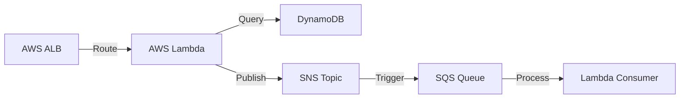
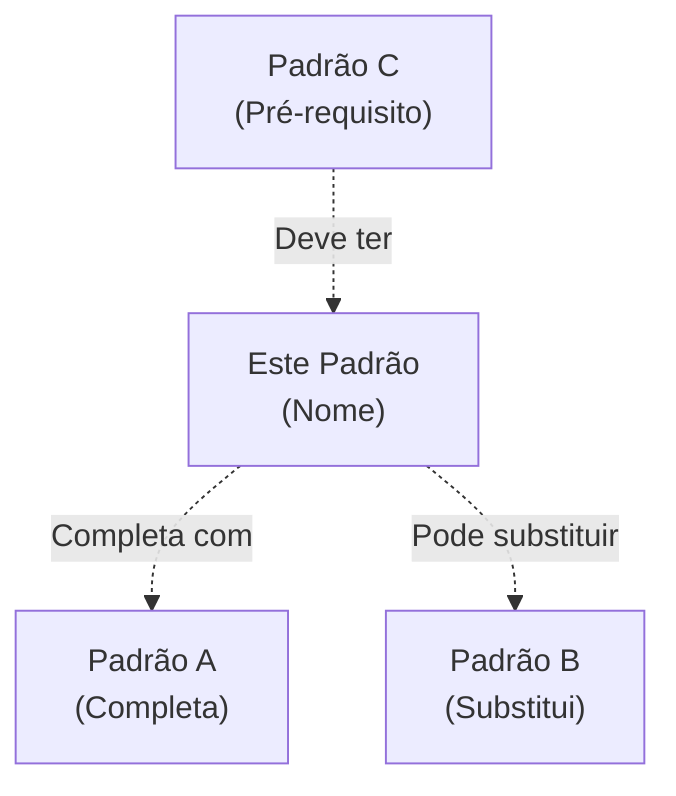

# 📖 PATTERN TEMPLATE

Use este template como base para documentar novos padrões arquiteturais no repositório.

```markdown
# [Nome do Padrão]

**Badge Status:** 
**Tecnologias:**   

---

## 📖 O que é?

Descreva o padrão em 2-3 parágrafos:
- Qual é o propósito do padrão
- Qual problema ele resolve
- Contexto em que é usado

**Metáfora/Analogia (opcional):** Uma comparação prática que ajude a entender.

---

## 🎯 Quando usar?

- ✅ Cenário 1: Descrição clara
- ✅ Cenário 2: Descrição clara
- ✅ Cenário 3: Descrição clara

**Indicadores de Quando Usar:**
- Sistema tem característica X
- Necessidade de resolver problema Y
- Equipe busca melhorar aspecto Z

---

## 🚫 Quando NÃO usar?

- ❌ Cenário 1: Por quê não é apropriado
- ❌ Cenário 2: Pode causar problema X
- ❌ Cenário 3: Complexidade injustificada

**Anti-patterns relacionados:**
- Uso desnecessário quando padrão simples resolve
- Aplicação prematura sem validar necessidade
- Forçar aplicação em contexto diferente

---

## 👍 Vantagens

| Vantagem | Descrição |
|----------|-----------|
| **Vantagem 1** | Benefício específico e comprovável |
| **Vantagem 2** | Impacto mensurável no sistema |
| **Vantagem 3** | Melhoria em aspecto específico |
| **Vantagem 4** | Redução de risco ou complexidade |

---

## 👎 Desvantagens

| Desvantagem | Impacto | Mitigation |
|-------------|--------|-----------|
| **Complexidade** | Aumenta quantidade de código | Documentação clara, automação |
| **Overhead** | Custo X em recursos | Monitorar e otimizar |
| **Curva de aprendizado** | Equipe precisa estudar | Treinamento e pair programming |
| **Manutenção** | Requer expertise | Documentação e boas práticas |

---

## 🏗️ Arquitetura

### Componentes Principais

```
┌─────────────────────────────────────┐
│         Componente A                │
│  - Responsabilidade 1               │
│  - Responsabilidade 2               │
└────────────┬────────────────────────┘
             │
             ▼
┌─────────────────────────────────────┐
│         Componente B                │
│  - Responsabilidade 3               │
│  - Responsabilidade 4               │
└─────────────────────────────────────┘
```

### Fluxo de Dados

1. **Entrada** - Como dados entram no padrão
2. **Processamento** - Como são processados
3. **Saída** - Como dados saem do padrão

### Pontos de Integração

- **Entrada:** Sistema/Componente X
- **Saída:** Sistema/Componente Y
- **Dependências:** Serviços requeridos
- **Lado-efeitos:** Operações secundárias

---

## 📊 Diagrama C4 / Mermaid

### Nível Sistema (Context)



### Nível Container



---

## 💻 Exemplo Java

### Dependências (pom.xml)

```xml
<dependency>
    <groupId>org.springframework.boot</groupId>
    <artifactId>spring-boot-starter-web</artifactId>
    <version>3.0.0</version>
</dependency>
```

### Implementação

```java
package com.example.pattern;

/**
 * Descrição da classe
 * @author seu-nome
 */
public class PatternExample {
    
    private final Dependency dependency;
    
    public PatternExample(Dependency dependency) {
        this.dependency = dependency;
    }
    
    /**
     * Método principal que implementa o padrão
     * @param input Entrada do padrão
     * @return Resultado processado
     */
    public Result execute(Input input) {
        // Implementação do padrão
        return new Result();
    }
}
```

### Teste Unitário

```java
@Test
void shouldExecutePatternCorrectly() {
    // Arrange
    PatternExample example = new PatternExample(mockDependency);
    
    // Act
    Result result = example.execute(new Input("test"));
    
    // Assert
    assertThat(result).isNotNull();
}
```

---

## 💻 Exemplo Node.js

### Dependências (package.json)

```json
{
  "dependencies": {
    "express": "^4.18.2",
    "axios": "^1.6.7"
  }
}
```

### Implementação

```javascript
const express = require('express');
const router = express.Router();

/**
 * Implementa o padrão
 * @param {Request} req - Requisição HTTP
 * @param {Response} res - Resposta HTTP
 */
router.post('/pattern', async (req, res) => {
    try {
        const { input } = req.body;
        
        // Lógica do padrão
        const result = await executePattern(input);
        
        res.json({ success: true, data: result });
    } catch (error) {
        res.status(500).json({ error: error.message });
    }
});

module.exports = router;
```

### Teste com cURL

```bash
# Testar padrão
curl -X POST http://localhost:3000/pattern \
  -H "Content-Type: application/json" \
  -d '{"input": "teste"}'

# Resposta esperada
# {"success": true, "data": {...}}
```

---

## ☁️ Exemplo AWS

### Serviços AWS Envolvidos



### Terraform (IaC)

```hcl
resource "aws_lambda_function" "pattern_example" {
  filename      = "lambda_function.zip"
  function_name = "pattern-example"
  role          = aws_iam_role.lambda_role.arn
  handler       = "index.handler"
  runtime       = "nodejs18.x"
  
  environment {
    variables = {
      TABLE_NAME = aws_dynamodb_table.example.name
    }
  }
}

resource "aws_dynamodb_table" "example" {
  name           = "pattern-table"
  billing_mode   = "PAY_PER_REQUEST"
  hash_key       = "id"
  
  attribute {
    name = "id"
    type = "S"
  }
}
```

### CloudFormation (JSON)

```json
{
  "Resources": {
    "PatternLambda": {
      "Type": "AWS::Lambda::Function",
      "Properties": {
        "FunctionName": "pattern-example",
        "Runtime": "nodejs18.x",
        "Handler": "index.handler"
      }
    }
  }
}
```

---

## 🧪 Como Testar

### Pré-requisitos

- Docker e Docker Compose
- Java 17+ ou Node.js 18+
- Git

### Teste Local com Docker

```bash
# 1. Clonar repositório
git clone <repo-url>
cd pattern-name

# 2. Subir ambiente
docker-compose up --build

# 3. Aguardar inicialização
# Logs devem mostrar "Server running on port XXXX"

# 4. Testar endpoints
curl http://localhost:3000/health
```

### Teste Automatizado

**Java:**
```bash
cd pattern-name
mvn clean test
```

**Node.js:**
```bash
cd pattern-name
npm install
npm test
```

### Cenários de Teste

| Cenário | Objetivo | Comando | Resultado Esperado |
|---------|----------|---------|-------------------|
| **Happy Path** | Sucesso normal | `curl http://localhost:3000/api` | Status 200 + dados |
| **Erro Validação** | Entrada inválida | `curl -d '{}' http://localhost:3000/api` | Status 400 + erro |
| **Timeout** | Comportamento com delay | Esperar > timeout | Status 504 ou retry |
| **Integração** | Comunicação entre serviços | `docker-compose logs` | Logs com fluxo completo |

### Ferramentas de Teste

```bash
# Teste de carga
ab -n 1000 -c 10 http://localhost:3000/api

# Teste de latência
time curl http://localhost:3000/api

# Inspeção de docker
docker-compose ps
docker-compose logs -f [service]

# Teste de resiliência
docker-compose pause [service]  # Simular falha
docker-compose unpause [service]
```

---

## 📈 Trade-offs

### Performance vs Complexidade

| Aspecto | Trade-off | Decisão |
|---------|-----------|---------|
| **Latência** | Mais features = mais tempo | Use cache, async processing |
| **Throughput** | Mais recursos = mais custo | Auto-scaling, optimization |
| **Consistência** | Forte vs Eventual | Escolher conforme requisito |

### Escalabilidade vs Manutenibilidade

- **Aumentar replicas:** Mais fácil de escalar, mais difícil manter estado
- **Banco centralizado:** Fácil consistência, difícil escalar
- **Sharding:** Escalável, muito complexo

### Custo vs Performance

```
Cenário 1: Otimizado para Custo
- Usar recursos compartilhados
- Cache agressivo
- Processamento batch
- Custo: $ | Performance: ⭐⭐

Cenário 2: Otimizado para Performance
- Recursos dedicados
- Cache em múltiplas camadas
- Processamento real-time
- Custo: $$$ | Performance: ⭐⭐⭐⭐⭐

Cenário 3: Balanceado (Recomendado)
- Auto-scaling conforme carga
- Cache seletivo
- Processamento híbrido
- Custo: $$ | Performance: ⭐⭐⭐⭐
```

---

## 🔗 Referências

### Documentação Oficial

- [Livro: Enterprise Integration Patterns](https://www.enterpriseintegrationpatterns.com/)
- [Microservices Patterns - Chris Richardson](https://microservices.io/)
- [O'Reilly: Building Microservices - Sam Newman](https://www.oreilly.com/)

### Padrões Relacionados

- [➡️ Padrão Relacionado 1](../related-pattern-1)
- [➡️ Padrão Relacionado 2](../related-pattern-2)
- [⬅️ Padrão Pré-requisito](../prerequisite-pattern)

### Ferramentas e Tecnologias

- **Java:** [Spring Cloud Docs](https://spring.io/projects/spring-cloud)
- **Node.js:** [Express Documentation](https://expressjs.com/)
- **AWS:** [AWS Architecture Center](https://aws.amazon.com/architecture/)
- **Docker:** [Docker Documentation](https://docs.docker.com/)

### Artigos Interessantes

- [Título do Artigo 1](url)
- [Título do Artigo 2](url)
- [Título do Artigo 3](url)

---

## 🧩 Padrões Relacionados



---

## ❓ Dúvidas Comuns

**P: Como começar com este padrão?**  
R: Comece com o exemplo Node.js, ele é mais simples. Depois explore o Docker Compose.

**P: Qual é o melhor caso de uso?**  
R: Quando você precisa [situação específica], este padrão é ideal.

**P: Como isso difere de [padrão similar]?**  
R: [Padrão similar] foca em X, enquanto este padrão foca em Y.

---

## 📝 Histórico de Mudanças

| Versão | Data | Mudança |
|--------|------|---------|
| 1.0 | 2026-07-14 | Versão inicial com exemplos |
| - | - | - |

---

**Autor:** [Seu Nome]  
**Última Atualização:** 2026-07-14  
**Status:** ✅ Pronto para Uso
```
