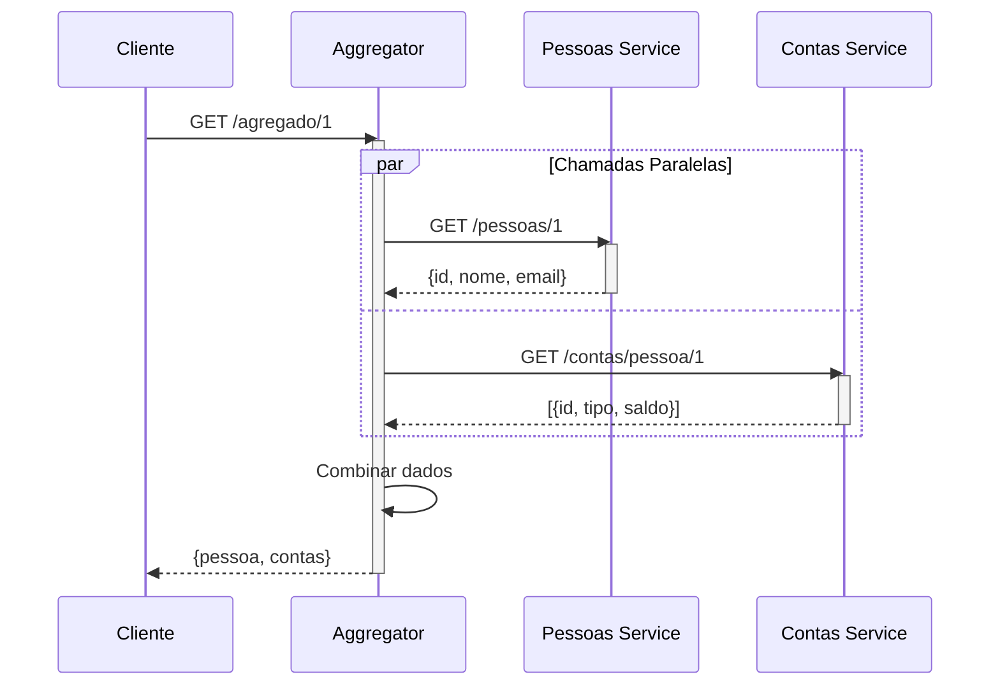
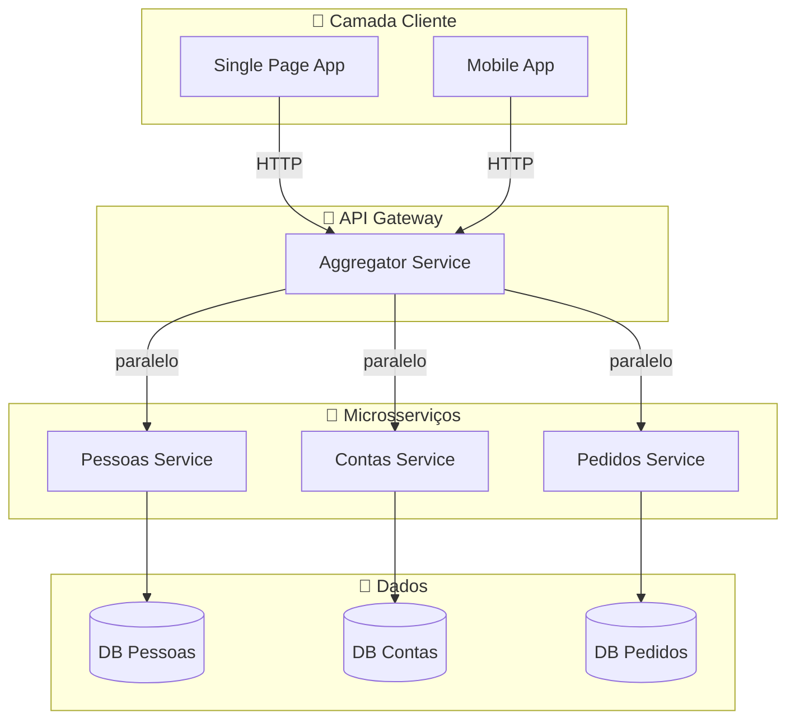
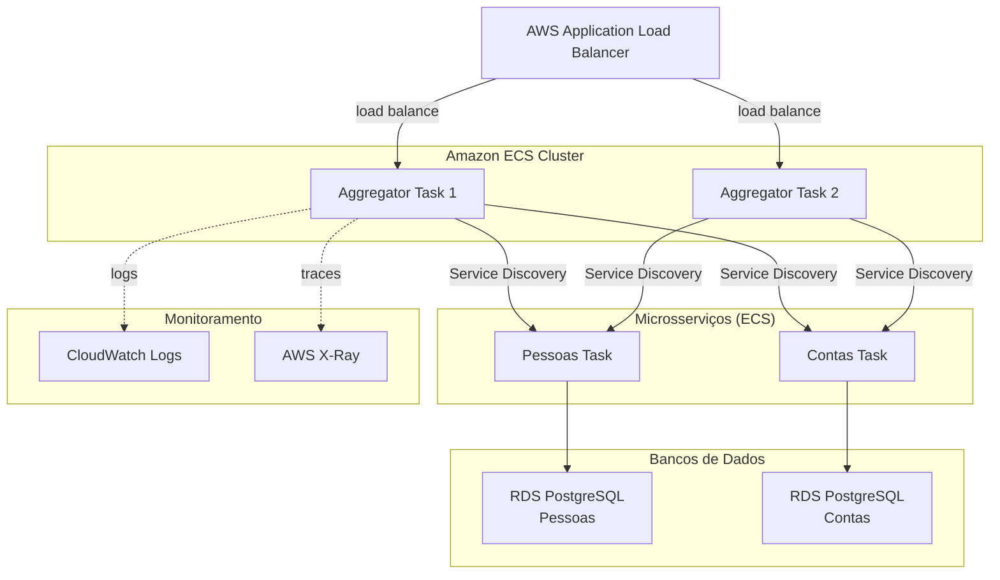
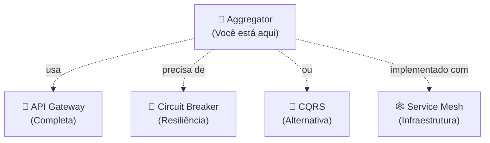

# 🔀 Aggregator Pattern

[](README.md)
[](https://nodejs.org)
[](docker-compose.yml)

---

## 📖 O que é?

O **Aggregator Pattern** é um padrão arquitetural onde um serviço centralizado orquestra chamadas a múltiplos microsserviços e **combina os resultados em uma única resposta agregada**.

Muito utilizado em conjunto com API Gateways, o Aggregator evita que o cliente precise fazer várias chamadas separadas para obter dados relacionados. É como um maestro que coordena diferentes instrumentos para criar uma sinfonia unificada.

**Analogia:** Imagine um restaurante (Aggregator) que, ao receber um pedido, coordena com a cozinha (serviço de pratos), adega (serviço de bebidas) e confeitaria (serviço de sobremesas), retornando tudo junto ao cliente em uma experiência unificada.

---

## 🎯 Quando usar?

- ✅ **Cliente precisa de dados de múltiplas fontes:** Combinar dados de Usuários, Pedidos e Pagamentos
- ✅ **Reduzir chamadas de rede:** Cliente faz 1 chamada ao invés de 3-4
- ✅ **Desacoplar cliente de múltiplos serviços:** Cliente só conhece o Aggregator
- ✅ **Enriquecer dados:** Transformar e consolidar informações antes de retornar
- ✅ **Aplicar lógica de negócio transversal:** Validações, autorizações centralizadas

**Indicadores de Quando Usar:**
- Sistema tem 3+ microsserviços que precisam ser chamados juntos
- Latência de rede é uma preocupação (chamadas em paralelo reduzem latência)
- Cliente é uma SPA, mobile app ou outra API que precisa de dados consolidados

---

## 🚫 Quando NÃO usar?

- ❌ **Dados vêm de uma única fonte:** Use gateway direto, sem agregação
- ❌ **Padrão de leitura simples:** Custa mais caro manter um aggregator
- ❌ **Cada microserviço é totalmente independente:** Sem necessidade de correlação
- ❌ **Latência é crítica e dados mudam constantemente:** Considere CQRS ao invés

**Anti-patterns:**
- Aggregator que chama serviços sequencialmente (derrota o propósito)
- Aggregator que contém lógica de negócio complexa (vira "God Service")
- Usar quando um simples JOIN no banco resolveria o problema

---

## 👍 Vantagens

| Vantagem | Descrição |
|----------|-----------|
| **Reduz Latência Percebida** | Chamadas paralelas são mais rápidas que sequenciais |
| **Desacoplamento** | Cliente não conhece detalhes dos serviços internos |
| **Flexibilidade de Dados** | Pode transformar, filtrar e enriquecer dados antes de retornar |
| **Ponto Único de Entrada** | Fácil de versionar, auditar e controlar acesso |
| **Facilita Evolução** | Pode mudança serviços internos sem impactar cliente |

---

## 👎 Desvantagens

| Desvantagem | Impacto | Mitigation |
|-------------|--------|-----------|
| **Ponto Único de Falha** | Se aggregator cai, tudo falha | Múltiplas instâncias, Load Balancer, Circuit Breaker |
| **Complexidade Adicional** | Mais componente para manter | Monitoramento, logs distribuídos |
| **"God Service"** | Pode crescer demais com lógica | Manter agregador simples, lógica nos serviços |
| **Overhead de Rede** | Múltiplas chamadas HTTP | Cache, índices, otimizar queries |
| **Cascata de Falhas** | Falha em 1 serviço falha agregação | Timeouts, fallbacks, retry policies |

---

## 🏗️ Arquitetura

### Componentes Principais

```
┌──────────────────────────────────────────────────────────────┐
│                      Cliente                                 │
│              (SPA, Mobile, Backend)                           │
└────────────────────┬─────────────────────────────────────────┘
                     │
                     │ 1 requisição HTTP
                     ▼
┌──────────────────────────────────────────────────────────────┐
│          🔀 AGGREGATOR SERVICE (porta 3000)                  │
│                                                               │
│  ┌─────────────────────────────────────────────────────┐     │
│  │ 1. Recebe requisição                                │     │
│  │ 2. Faz chamadas paralelas                           │     │
│  │ 3. Aguarda respostas (Promise.all)                  │     │
│  │ 4. Combina dados                                    │     │
│  │ 5. Retorna resposta agregada                        │     │
│  └─────────────────────────────────────────────────────┘     │
└────┬──────────────────────┬──────────────────────┬───────────┘
     │                      │                      │
     │ 2a                   │ 2b                   │ 2c
     ▼ (paralelo)           ▼ (paralelo)           ▼ (paralelo)
┌──────────────┐  ┌──────────────┐  ┌──────────────┐
│  PESSOAS     │  │  CONTAS      │  │  PEDIDOS     │
│ (porta 3001) │  │ (porta 3002) │  │ (porta 3003) │
│              │  │              │  │              │
│ GET /pessoas │  │ GET /contas  │  │ GET /pedidos │
│ POST /pessoas│  │ POST /contas │  │ POST /pedidos│
└──────────────┘  └──────────────┘  └──────────────┘
```

### Fluxo de Dados

1. **Entrada:** Cliente envia `/agregado?pessoaId=1`
2. **Orquestração:** Aggregator dispara 3 chamadas paralelas
3. **Processamento:** Cada serviço processa sua requisição
4. **Consolidação:** Dados são combinados na memória
5. **Saída:** Resposta unificada retorna ao cliente

---

## 📊 Diagrama Mermaid

### Sequência de Chamadas



### Arquitetura de Componentes



---

## 💻 Exemplo Node.js

### Estrutura do Projeto

```
aggregator/
├── aggregator/                 # Serviço Aggregator
│   ├── src/
│   │   └── index.js
│   ├── Dockerfile
│   └── package.json
├── pessoas/                    # Microsserviço Pessoas
│   ├── src/
│   │   └── index.js
│   ├── Dockerfile
│   └── package.json
├── contas/                     # Microsserviço Contas
│   ├── src/
│   │   └── index.js
│   ├── Dockerfile
│   └── package.json
└── docker-compose.yml
```

### Implementação do Aggregator

```javascript
const express = require('express');
const axios = require('axios');

const app = express();
const PORT = 3000;

// URLs dos microsserviços
const PESSOAS_URL = 'http://pessoas:3001';
const CONTAS_URL = 'http://contas:3002';

/**
 * Agregador que combina pessoas e contas
 * Faz chamadas PARALELAS para melhor performance
 */
app.get('/agregado', async (req, res) => {
    try {
        // Promise.all executa chamadas em paralelo
        const [pessoasRes, contasRes] = await Promise.all([
            axios.get(`${PESSOAS_URL}/pessoas`),
            axios.get(`${CONTAS_URL}/contas`)
        ]);

        const pessoas = pessoasRes.data;
        const contas = contasRes.data;

        // Agregar: associar contas a pessoas
        const agregado = pessoas.map(pessoa => ({
            ...pessoa,
            contas: contas.filter(c => c.pessoaId === pessoa.id)
        }));

        res.json(agregado);
    } catch (error) {
        console.error('Erro ao agregar:', error.message);
        res.status(500).json({ erro: 'Falha ao agregar dados' });
    }
});

/**
 * Agregador por ID específico
 */
app.get('/agregado/:id', async (req, res) => {
    try {
        const { id } = req.params;

        const [pessoaRes, contasRes] = await Promise.all([
            axios.get(`${PESSOAS_URL}/pessoas/${id}`),
            axios.get(`${CONTAS_URL}/contas/pessoa/${id}`)
        ]);

        const agregado = {
            ...pessoaRes.data,
            contas: contasRes.data
        };

        res.json(agregado);
    } catch (error) {
        if (error.response?.status === 404) {
            return res.status(404).json({ erro: 'Pessoa não encontrada' });
        }
        res.status(500).json({ erro: 'Erro ao agregar' });
    }
});

app.listen(PORT, () => {
    console.log(`Aggregator rodando na porta ${PORT}`);
});
```

### Microsserviço Pessoas (Exemplo)

```javascript
const express = require('express');
const app = express();
const PORT = 3001;

// Dados em memória (simular banco de dados)
const pessoas = [
    { id: 1, nome: 'Alice Silva', email: 'alice@example.com' },
    { id: 2, nome: 'Bob Souza', email: 'bob@example.com' }
];

app.get('/pessoas', (req, res) => res.json(pessoas));
app.get('/pessoas/:id', (req, res) => {
    const pessoa = pessoas.find(p => p.id === parseInt(req.params.id));
    pessoa ? res.json(pessoa) : res.status(404).json({ erro: 'Não encontrado' });
});

app.listen(PORT, () => console.log(`Pessoas em ${PORT}`));
```

---

## 💻 Exemplo Java

### Dependências (pom.xml)

```xml
<dependency>
    <groupId>org.springframework.boot</groupId>
    <artifactId>spring-boot-starter-webflux</artifactId>
    <version>3.0.0</version>
</dependency>
<dependency>
    <groupId>io.projectreactor.addons</groupId>
    <artifactId>reactor-extra</artifactId>
    <version>2022.0.0</version>
</dependency>
```

### Implementação do Aggregator (Spring Boot)

```java
package com.example.aggregator;

import org.springframework.stereotype.Service;
import org.springframework.web.reactive.function.client.WebClient;
import reactor.core.publisher.Mono;
import java.util.List;

@Service
public class AggregatorService {
    
    private final WebClient webClient;
    private static final String PESSOAS_URL = "http://pessoas:8001";
    private static final String CONTAS_URL = "http://contas:8002";
    
    public AggregatorService(WebClient.Builder webClientBuilder) {
        this.webClient = webClientBuilder.build();
    }
    
    /**
     * Agrega dados de múltiplos serviços de forma reativa
     */
    public Mono<PessoaComContas> agregadoPorId(Long pessoaId) {
        Mono<Pessoa> pessoaMono = webClient
            .get()
            .uri(PESSOAS_URL + "/pessoas/{id}", pessoaId)
            .retrieve()
            .bodyToMono(Pessoa.class);
        
        Mono<List<Conta>> contasMono = webClient
            .get()
            .uri(CONTAS_URL + "/contas/pessoa/{pessoaId}", pessoaId)
            .retrieve()
            .bodyToFlux(Conta.class)
            .collectList();
        
        // Combinar as duas chamadas
        return Mono.zip(pessoaMono, contasMono)
            .map(tuple -> new PessoaComContas(tuple.getT1(), tuple.getT2()));
    }
}
```

### Controller REST

```java
@RestController
@RequestMapping("/agregado")
public class AggregatorController {
    
    private final AggregatorService service;
    
    @GetMapping("/{id}")
    public Mono<PessoaComContas> getAgregado(@PathVariable Long id) {
        return service.agregadoPorId(id);
    }
}
```

### Teste Unitário

```java
@SpringBootTest
class AggregatorServiceTest {
    
    @MockBean
    private WebClient webClient;
    
    @Autowired
    private AggregatorService service;
    
    @Test
    void shouldAgregateUserWithAccounts() {
        // Arrange
        Long userId = 1L;
        Pessoa pessoa = new Pessoa(1L, "Alice", "alice@example.com");
        List<Conta> contas = List.of(
            new Conta(101L, 1L, "corrente", 1500.00)
        );
        
        // Mock chamadas
        // ... setup do mock
        
        // Act
        Mono<PessoaComContas> result = service.agregadoPorId(userId);
        
        // Assert
        StepVerifier.create(result)
            .assertNext(agregado -> {
                assertThat(agregado.getPessoa().getNome()).isEqualTo("Alice");
                assertThat(agregado.getContas()).hasSize(1);
            })
            .verifyComplete();
    }
}
```

---

## ☁️ Exemplo AWS

### Arquitetura com AWS



### Terraform para Deploy

```hcl
# ECR Repositories
resource "aws_ecr_repository" "aggregator" {
  name = "aggregator"
}

# ECS Cluster
resource "aws_ecs_cluster" "main" {
  name = "microservices-cluster"
}

# Task Definition
resource "aws_ecs_task_definition" "aggregator" {
  family                   = "aggregator"
  network_mode             = "awsvpc"
  requires_compatibilities = ["FARGATE"]
  cpu                      = "256"
  memory                   = "512"
  
  container_definitions = jsonencode([{
    name      = "aggregator"
    image     = "${aws_ecr_repository.aggregator.repository_url}:latest"
    essential = true
    
    portMappings = [{
      containerPort = 3000
      hostPort      = 3000
      protocol      = "tcp"
    }]
    
    environment = [
      {
        name  = "PESSOAS_URL"
        value = "http://pessoas:3001"
      },
      {
        name  = "CONTAS_URL"
        value = "http://contas:3002"
      }
    ]
    
    logConfiguration = {
      logDriver = "awslogs"
      options = {
        "awslogs-group"         = aws_cloudwatch_log_group.aggregator.name
        "awslogs-region"        = var.aws_region
        "awslogs-stream-prefix" = "ecs"
      }
    }
  }])
}

# Service
resource "aws_ecs_service" "aggregator" {
  name            = "aggregator"
  cluster         = aws_ecs_cluster.main.id
  task_definition = aws_ecs_task_definition.aggregator.arn
  desired_count   = 2
  
  network_configuration {
    subnets         = var.private_subnets
    security_groups = [aws_security_group.ecs.id]
  }
  
  load_balancer {
    target_group_arn = aws_lb_target_group.aggregator.arn
    container_name   = "aggregator"
    container_port   = 3000
  }
}
```

---

## 🧪 Como Testar

### Pré-requisitos

- Docker e Docker Compose
- Node.js 18+ ou Java 17+
- curl ou Postman

### Teste com Docker Compose

```bash
# 1. Navegar até o diretório
cd aggregator

# 2. Subir os serviços
docker-compose up --build

# Saída esperada:
# agregador_1  | Aggregator rodando na porta 3000
# pessoas_1    | Pessoas rodando na porta 3001
# contas_1     | Contas rodando na porta 3002

# 3. Aguardar ~5 segundos para inicialização completa
sleep 5

# 4. Testar endpoints
```

### Testes de Funcionalidade

```bash
# Teste 1: Obter todos agregados
curl -X GET http://localhost:3000/agregado | jq

# Teste 2: Obter agregado por ID
curl -X GET http://localhost:3000/agregado/1 | jq

# Teste 3: Verificar serviço Pessoas isoladamente
curl -X GET http://localhost:3001/pessoas | jq

# Teste 4: Verificar serviço Contas isoladamente
curl -X GET http://localhost:3002/contas | jq

# Teste 5: Contas de pessoa específica
curl -X GET http://localhost:3002/contas/pessoa/1 | jq
```

### Testes de Resiliência

```bash
# Simular falha de um serviço
docker-compose pause pessoas

# Tentar chamar agregador (deve falhar com graceful error)
curl -X GET http://localhost:3000/agregado/1

# Recuperar serviço
docker-compose unpause pessoas

# Tentar novamente (deve recuperar)
curl -X GET http://localhost:3000/agregado/1
```

### Testes de Performance

```bash
# Teste de carga (100 requisições, 10 concorrentes)
ab -n 100 -c 10 http://localhost:3000/agregado

# Medir latência
time curl http://localhost:3000/agregado/1

# Ver logs de todos os serviços
docker-compose logs -f
```

### Teste Automatizado (Node.js)

```bash
cd aggregator/aggregator
npm install
npm test
```

---

## 📈 Trade-offs

### Performance vs Resiliência

```
Cenário 1: Falha Rápida (Fail-Fast)
┌─────────────────────────────────┐
│ Se qualquer serviço falhar,     │
│ retorna erro imediatamente      │
├─────────────────────────────────┤
│ ✅ Rápido descobrir falhas      │
│ ❌ Cliente recebe erro total    │
│ ❌ Perder dados parciais        │
└─────────────────────────────────┘

Cenário 2: Retorno Parcial (Graceful Degradation)
┌─────────────────────────────────┐
│ Se um serviço falha, retorna    │
│ dados dos que responderam       │
├─────────────────────────────────┤
│ ✅ Usuário recebe algo          │
│ ✅ Melhor UX                    │
│ ❌ Dados incompletos podem      │
│    confundir cliente            │
└─────────────────────────────────┘

Cenário 3: Fallback com Cache (Recomendado)
┌─────────────────────────────────┐
│ Se serviço falha, tenta cache;  │
│ se cache vazio, retorna erro    │
├─────────────────────────────────┤
│ ✅ Melhor resiliência           │
│ ✅ Dados possivelmente recentes │
│ ⚠️  Requer infraestrutura cache │
└─────────────────────────────────┘
```

### Latência: Serial vs Paralelo

| Abordagem | Tempo | Uso |
|-----------|-------|-----|
| **Serial** | 100ms + 100ms + 100ms = 300ms | Simples, para poucos serviços |
| **Paralelo** | max(100ms, 100ms, 100ms) = 100ms | **Recomendado**, reduz latência 3x |
| **Cache** | 10ms (hit) / 100ms (miss) | Melhor, mas requer invalidação |

### Escalabilidade

```
Problema: Aggregator vira gargalo
┌──────────────────────────────────────────┐
│ 1 Aggregator x 100 Requisições/s         │
│ → CPU: 80%, Memoria: 70%                 │
│ → Latência: 500ms                        │
└──────────────────────────────────────────┘

Solução: Múltiplas Instâncias
┌──────────────────────────────────────────┐
│ 3 Aggregators x 33 Requisições/s cada   │
│ (Load Balancer distribui)                │
│ → CPU: 30%, Memoria: 25% cada            │
│ → Latência: 100ms                        │
│ → Disponibilidade: 99.9%                 │
└──────────────────────────────────────────┘
```

---

## 🔗 Referências

### Documentação Oficial

- [Enterprise Integration Patterns - Aggregator](https://www.enterpriseintegrationpatterns.com/patterns/messaging/Aggregator.html)
- [Microservices Patterns - API Composition](https://microservices.io/patterns/data/api-composition.html)
- [AWS Microservices Best Practices](https://docs.aws.amazon.com/whitepapers/latest/microservices-on-aws/)

### Padrões Relacionados

- [➡️ API Gateway](../apigateway) - Ponto de entrada único
- [➡️ Circuit Breaker](../circuit_breaker) - Resiliência
- [➡️ Service Discovery](https://microservices.io/patterns/service-discovery.html) - Encontrar serviços
- [⬅️ CQRS](https://microservices.io/patterns/data/cqrs.html) - Alternativa para leitura escalável

### Ferramentas

- **Node.js:** [Express Documentation](https://expressjs.com/), [Axios](https://axios-http.com/)
- **Java:** [Spring Cloud Documentation](https://spring.io/projects/spring-cloud)
- **Docker:** [Docker Compose Reference](https://docs.docker.com/compose/compose-file/)
- **AWS:** [ECS Documentation](https://aws.amazon.com/ecs/), [ALB](https://aws.amazon.com/elasticloadbalancing/)

### Artigos Interessantes

- [Building Microservices by Sam Newman](https://www.oreilly.com/library/view/building-microservices/9781491950340/) - Cap. 4: Integração
- [Microservices Patterns - Chris Richardson](https://microservices.io/) - Agregador e composição de APIs
- [API Composition Pattern](https://microservices.io/patterns/data/api-composition.html) - Padrão detalhado

---

## 🧩 Padrões Relacionados



---

## ❓ Dúvidas Comuns

**P: Como começar com este padrão?**  
R: Comece com `docker-compose up` no diretório `aggregator/`. Depois explore os arquivos `src/index.js` para entender o fluxo.

**P: Qual é a diferença entre Aggregator e API Gateway?**  
R: **API Gateway** é um ponto de entrada único que roteia requests. **Aggregator** é um serviço que orquestra múltiplos serviços e combina respostas. Geralmente um API Gateway contém ou usa um Aggregator.

**P: Como lidar com timeouts de serviços?**  
R: Use `Promise.race()` para timeout ou implemente retry com backoff exponencial. Melhor: use Circuit Breaker + fallback.

**P: E se um serviço for muito lento?**  
R: Implemente cache, use timeout curto com fallback, ou considere CQRS com read models pré-calculadas.

---

## 📝 Histórico de Mudanças

| Versão | Data | Mudança |
|--------|------|---------|
| 2.0 | 2026-07-14 | Atualizado com novo template: mais exemplos Java/AWS, diagramas Mermaid |
| 1.0 | 2026-06-XX | Versão inicial com exemplos Node.js |

---

**Autor:** Daniel Augusto Smanioto  
**Última Atualização:** 2026-07-14  
**Status:** ✅ Pronto para Produção
