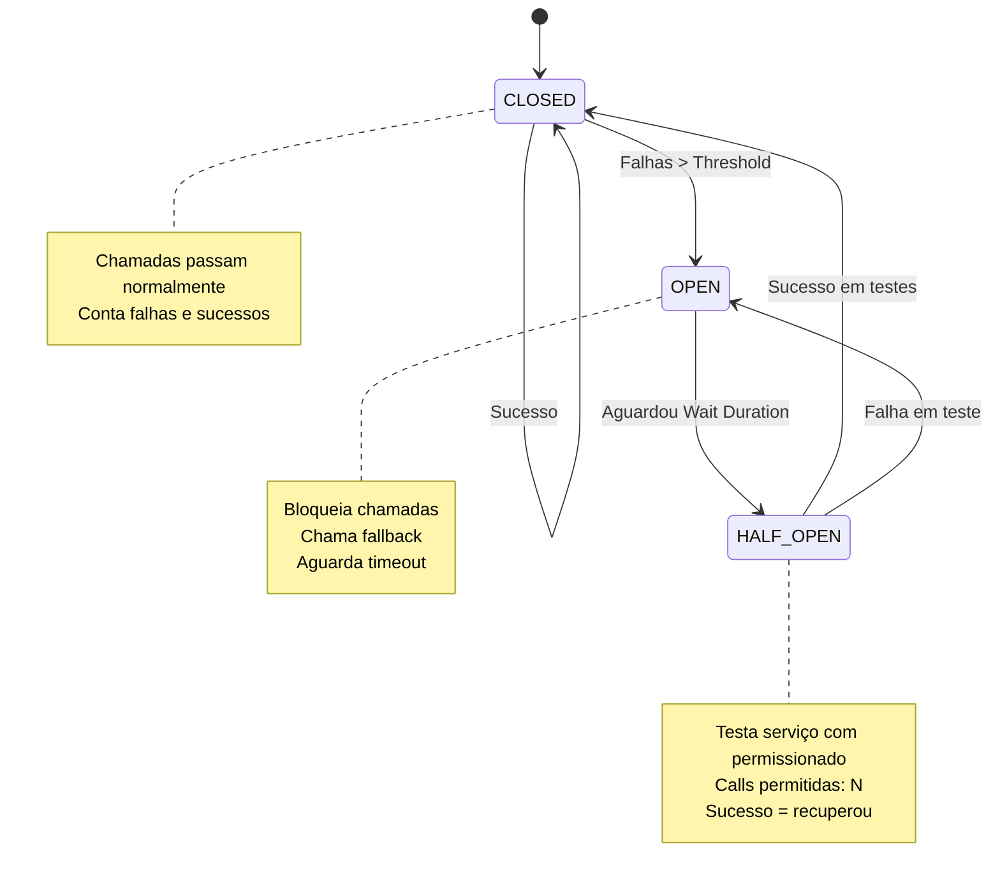
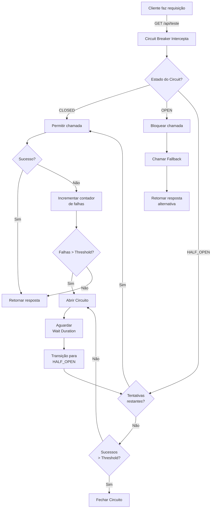
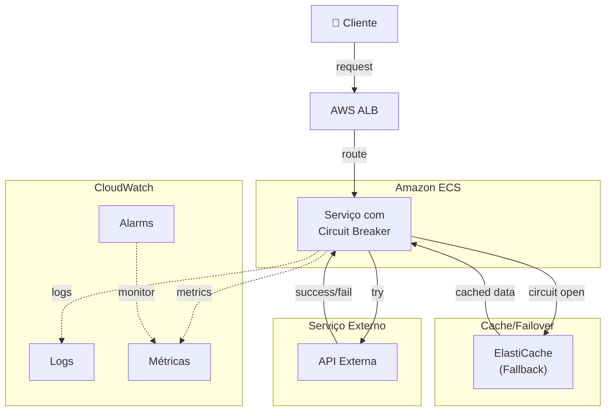
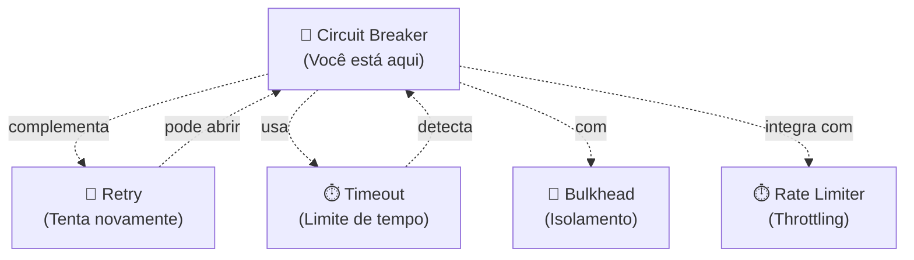

# 🔌 Circuit Breaker Pattern

[](README.md)
[](https://www.java.com)
[](https://spring.io/projects/spring-boot)
[](https://resilience4j.readme.io/)

---

## 📖 O que é?

O **Circuit Breaker Pattern** é um padrão de resiliência que previne falhas em cascata interrompendo chamadas para serviços que estão instáveis. Como um disjuntor elétrico, ele "abre o circuito" quando detecta muitas falhas, evitando desperdiçar recursos tentando chamar um serviço que não está respondendo.

**Analogia:** Imagine um disjuntor em sua casa. Quando detecta uma sobrecarga (muitas falhas), ele desliga automaticamente o circuito (abre o circuito) antes que cause mais dano. Depois de um tempo, tenta religar (half-open) para verificar se o problema foi resolvido.

**Estados do Circuit Breaker:**
- 🟢 **CLOSED** - Funcionando normal, todas as chamadas passam
- 🟡 **HALF_OPEN** - Testando se o serviço se recuperou
- 🔴 **OPEN** - Serviço está falhando, chamadas são bloqueadas

---

## 🎯 Quando usar?

- ✅ **Serviço externo é instável:** Proteger aplicação de serviços com taxa alta de falha
- ✅ **Latência variável:** Evitar wait infinito por resposta lenta
- ✅ **Falhas em cascata:** Impedir que falha se propague de serviço para serviço
- ✅ **Degradação Graciosa:** Retornar resposta alternativa quando serviço falha
- ✅ **Timeout Dinâmico:** Ajustar comportamento baseado em padrões de falha

**Indicadores de Quando Usar:**
- Taxa de erro > 50% em um serviço
- Latência P99 > seu timeout
- Serviço externo sem SLA garantido
- Riscos de cascata de falhas

---

## 🚫 Quando NÃO usar?

- ❌ **Serviço é 100% confiável:** Não precisa de proteção
- ❌ **Falhas são raras e isoladas:** Use retry simples com backoff
- ❌ **Requisitos de consistência forte:** Circuit Breaker retorna stale data
- ❌ **Você não tem fallback alternativo:** De que adianta abrir circuito?
- ❌ **Overhead é crítico:** Anotações e AOP adicionam latência

**Anti-patterns:**
- Abrir circuito imediatamente (sem threshold mínimo de falhas)
- Sem fallback (usuario vê erro brutal)
- Timeout muito longo (derrota o propósito)
- Não monitorar estado do circuito

---

## 👍 Vantagens

| Vantagem | Descrição |
|----------|-----------|
| **Impede Cascata** | Para falhas antes de se propagarem |
| **Degrada Graciosamente** | Retorna resposta alternativa (fallback) |
| **Libera Recursos** | Não desperdiça tentativas em serviço falhando |
| **Detecta Recuperação** | Testa serviço periodicamente (HALF_OPEN) |
| **Resiliência Automática** | Sem código manual de retry/backoff |
| **Observabilidade** | Métricas claras de falhas e recuperação |

---

## 👎 Desvantagens

| Desvantagem | Impacto | Mitigation |
|-------------|--------|-----------|
| **Requer Fallback** | Sem alternativa, usuário recebe erro | Implementar cache ou default |
| **Stale Data** | Pode retornar dados desatualizados | Invalidação apropriada |
| **Overhead** | AOP/Reflection tem custo | Negligenciável com Resilience4j |
| **Configuração Complexa** | Threshold, timeout, retry corretos | Monitorar e ajustar |
| **Falsos Positivos** | Abrir circuito por spike temporário | Aumentar threshold mínimo |

---

## 🏗️ Arquitetura

### Estados e Transições

```
┌─────────────────────────────────────────────────────────┐
│              CLOSED (Funcionando Normal)                │
│                                                         │
│  Chamadas passam normalmente                            │
│  Contador de falhas zera                                │
│  Contador de sucessos incrementa                        │
└──────────────────┬──────────────────────────────────────┘
                   │
         Falhas > Threshold?
         (ex: 5 falhas em 10 chamadas)
                   │
                   ▼
┌─────────────────────────────────────────────────────────┐
│                OPEN (Falha Detectada)                   │
│                                                         │
│  Chamadas são bloqueadas                                │
│  Fallback é chamado                                     │
│  Timer aguarda (ex: 30 segundos)                        │
└──────────────────┬──────────────────────────────────────┘
                   │
         Timeout expirou?
                   │
                   ▼
┌─────────────────────────────────────────────────────────┐
│           HALF_OPEN (Testando Recuperação)              │
│                                                         │
│  Permitidas N chamadas de teste (ex: 3)                 │
│  Se sucesso → volta para CLOSED                         │
│  Se falha → volta para OPEN                             │
└──────────────────┬──────────────────────────────────────┘
                   │
      Sucesso ou Falha após N testes?
                   │
           ┌───────┴───────┐
           ▼               ▼
        CLOSED          OPEN
```

### Componentes Principais

```
┌──────────────────────────────────────────────────────────┐
│               Chamada HTTP de Cliente                    │
└────────────────────┬─────────────────────────────────────┘
                     │
                     ▼
┌──────────────────────────────────────────────────────────┐
│     Spring AOP Interceptor (@CircuitBreaker)            │
└────────────────────┬─────────────────────────────────────┘
                     │
                     ▼
      ┌──────────────────────────────┐
      │ Qual é o estado do Circuit?  │
      └──────────────────────────────┘
                     │
        ┌────────────┼────────────┐
        ▼            ▼            ▼
    ┌─────────┐ ┌─────────┐ ┌──────────┐
    │ CLOSED  │ │  OPEN   │ │HALF_OPEN │
    │         │ │         │ │          │
    │Chamar  │ │Chamar  │ │Chamar   │
    │Serviço │ │Fallback│ │Serviço  │
    └────┬────┘ └─────────┘ │(teste) │
         │                  └────┬────┘
         ▼                       │
    ┌─────────────────┐         ▼
    │ Registrar       │    ┌──────────────┐
    │ Sucesso/Erro    │    │ Registrar    │
    └────────┬────────┘    │ Teste Result │
             │             └────────┬─────┘
             │                      │
    ┌────────┴──────────────────────┴───────┐
    │ Atualizar Métricas e Estado           │
    └────────┬──────────────────────────────┘
             │
             ▼
    ┌─────────────────────────────────┐
    │ Retornar Resposta ou Erro       │
    └─────────────────────────────────┘
```

---

## 📊 Diagrama Mermaid

### Máquina de Estados



### Fluxo de Decisão



---

## 💻 Exemplo Java (Spring Boot + Resilience4j)

### Dependências (build.gradle.kts)

```kotlin
dependencies {
    implementation("org.springframework.boot:spring-boot-starter-web")
    implementation("org.springframework.boot:spring-boot-starter-aop")
    implementation("io.github.resilience4j:resilience4j-spring-boot3:2.2.0")
    implementation("io.github.resilience4j:resilience4j-circuitbreaker:2.2.0")
    testImplementation("org.springframework.boot:spring-boot-starter-test")
}
```

### Configuração Básica

```java
package com.example.circuitbreaker.config;

import io.github.resilience4j.circuitbreaker.CircuitBreaker;
import io.github.resilience4j.circuitbreaker.CircuitBreakerConfig;
import io.github.resilience4j.circuitbreaker.CircuitBreakerRegistry;
import org.springframework.context.annotation.Bean;
import org.springframework.context.annotation.Configuration;

import java.time.Duration;

@Configuration
public class CircuitBreakerConfig {
    
    /**
     * Configurar CircuitBreaker com thresholds customizados
     */
    @Bean
    public CircuitBreaker meuCircuitBreaker() {
        CircuitBreakerConfig config = CircuitBreakerConfig.custom()
            // Falhas permitidas antes de abrir (slidingWindow size)
            .slidingWindowSize(10)
            
            // Quantas falhas aciona abertura (50% de 10 = 5)
            .failureRateThreshold(50.0f)
            
            // Tempo antes de tentar recuperação (HALF_OPEN)
            .waitDurationInOpenState(Duration.ofSeconds(30))
            
            // Chamadas permitidas no estado HALF_OPEN
            .permittedNumberOfCallsInHalfOpenState(3)
            
            // Registrar apenas exceções específicas como falhas
            .recordExceptions(RuntimeException.class)
            .build();
        
        return CircuitBreakerRegistry.ofDefaults()
            .circuitBreaker("meuCircuitBreaker", config);
    }
}
```

### Implementação com Anotação

```java
package com.example.circuitbreaker.controller;

import io.github.resilience4j.circuitbreaker.annotation.CircuitBreaker;
import org.springframework.http.ResponseEntity;
import org.springframework.web.bind.annotation.GetMapping;
import org.springframework.web.bind.annotation.RestController;
import org.springframework.web.client.RestTemplate;

@RestController
public class DemoController {
    
    private final RestTemplate restTemplate = new RestTemplate();
    
    /**
     * Endpoint com proteção de CircuitBreaker
     * Se falhar 5 vezes em 10 chamadas, abre o circuito
     */
    @GetMapping("/api/recurso")
    @CircuitBreaker(name = "meuCircuitBreaker", fallbackMethod = "recursoFallback")
    public ResponseEntity<String> chamarServicoExterno() {
        // Simular chamada a serviço externo
        String resposta = restTemplate.getForObject(
            "http://servico-externo/dados",
            String.class
        );
        return ResponseEntity.ok(resposta);
    }
    
    /**
     * Fallback - chamado quando circuito está aberto
     * @param ex Exceção que causou a falha
     * @return Resposta alternativa
     */
    public ResponseEntity<String> recursoFallback(Throwable ex) {
        System.err.println("❌ CircuitBreaker aberto! Erro: " + ex.getMessage());
        
        return ResponseEntity
            .status(503)
            .body("Serviço temporariamente indisponível. " +
                  "Tente novamente em alguns momentos.");
    }
}
```

### Implementação Programática

```java
package com.example.circuitbreaker.service;

import io.github.resilience4j.circuitbreaker.CircuitBreaker;
import org.springframework.stereotype.Service;

@Service
public class ResilientService {
    
    private final CircuitBreaker circuitBreaker;
    
    public ResilientService(CircuitBreaker circuitBreaker) {
        this.circuitBreaker = circuitBreaker;
    }
    
    /**
     * Usar CircuitBreaker de forma programática
     */
    public String chamarComProtecao() {
        return circuitBreaker.executeSupplier(() -> {
            // Lógica que pode falhar
            if (Math.random() < 0.3) {
                throw new RuntimeException("Falha simulada!");
            }
            return "✅ Sucesso!";
        });
    }
    
    /**
     * Com fallback personalizado
     */
    public String chamarComFallback() {
        return circuitBreaker.executeSupplier(
            () -> chamarServicoExterno(),  // Lógica principal
            throwable -> "⚠️ Fallback: Serviço indisponível"  // Fallback
        );
    }
    
    private String chamarServicoExterno() {
        // Simulação de chamada que pode falhar
        if (System.currentTimeMillis() % 2 == 0) {
            throw new RuntimeException("Falha aleatória");
        }
        return "Dados do serviço externo";
    }
}
```

### Teste Unitário

```java
package com.example.circuitbreaker.controller;

import io.github.resilience4j.circuitbreaker.CircuitBreaker;
import io.github.resilience4j.circuitbreaker.CircuitBreakerRegistry;
import org.junit.jupiter.api.Test;
import org.springframework.boot.test.autoconfigure.web.servlet.AutoConfigureMockMvc;
import org.springframework.boot.test.context.SpringBootTest;
import org.springframework.test.web.servlet.MockMvc;
import org.springframework.beans.factory.annotation.Autowired;

import static org.springframework.test.web.servlet.request.MockMvcRequestBuilders.get;
import static org.springframework.test.web.servlet.result.MockMvcResultMatchers.status;

@SpringBootTest
@AutoConfigureMockMvc
class CircuitBreakerTest {
    
    @Autowired
    private MockMvc mockMvc;
    
    @Autowired
    private CircuitBreakerRegistry registry;
    
    @Test
    void shouldReturnSuccessWhenServiceResponds() throws Exception {
        mockMvc.perform(get("/api/recurso"))
            .andExpect(status().isOk());
    }
    
    @Test
    void shouldReturnFallbackWhenCircuitOpen() throws Exception {
        CircuitBreaker cb = registry.circuitBreaker("meuCircuitBreaker");
        
        // Simular falhas para abrir circuito
        for (int i = 0; i < 5; i++) {
            try {
                mockMvc.perform(get("/api/recurso"));
            } catch (Exception e) {
                // Ignorar
            }
        }
        
        // Verificar que circuito está aberto e fallback é acionado
        mockMvc.perform(get("/api/recurso"))
            .andExpect(status().isServiceUnavailable());
    }
}
```

---

## 💻 Exemplo Node.js

```javascript
// npm install axios opossum

const express = require('express');
const axios = require('axios');
const CircuitBreaker = require('opossum');

const app = express();

// Configurar circuito breaker
const breaker = new CircuitBreaker(
    // Função que pode falhar
    async (url) => {
        const response = await axios.get(url);
        return response.data;
    },
    {
        timeout: 5000,           // Timeout: 5s
        errorThresholdPercentage: 50,  // 50% de erro abre
        resetTimeout: 30000,     // Tentar recuperar após 30s
        name: 'ExternalServiceBreaker'
    }
);

// Fallback
breaker.fallback(() => {
    return { error: 'Serviço indisponível', cached: true };
});

app.get('/api/recurso', async (req, res) => {
    try {
        const data = await breaker.fire(
            'http://servico-externo/dados'
        );
        res.json(data);
    } catch (error) {
        res.status(503).json({
            error: 'Serviço temporariamente indisponível'
        });
    }
});

app.listen(3000, () => {
    console.log('Servidor rodando com Circuit Breaker');
});
```

---

## ☁️ Exemplo AWS

### Arquitetura com AWS



### Lambda com Circuit Breaker

```java
// AWS Lambda com Resilience4j

import com.amazonaws.services.lambda.runtime.Context;
import com.amazonaws.services.lambda.runtime.RequestHandler;
import io.github.resilience4j.circuitbreaker.annotation.CircuitBreaker;

public class CircuitBreakerLambda implements RequestHandler<Map<String, Object>, Map<String, Object>> {
    
    @Override
    @CircuitBreaker(name = "lambdaBreaker", fallbackMethod = "handleFallback")
    public Map<String, Object> handleRequest(Map<String, Object> input, Context context) {
        // Chamar API externa
        String result = callExternalAPI();
        
        return Map.of(
            "statusCode", 200,
            "body", result
        );
    }
    
    public Map<String, Object> handleFallback(Throwable ex) {
        return Map.of(
            "statusCode", 503,
            "body", "Circuit breaker ativado"
        );
    }
    
    private String callExternalAPI() {
        // Implementação
        return "dados";
    }
}
```

---

## 🧪 Como Testar

### Pré-requisitos

- Java 17+
- Gradle
- curl

### Teste Local

```bash
# 1. Navegar até o diretório
cd circuit_breaker

# 2. Build e run
./gradlew bootRun

# Saída esperada:
# Started Application in X.XXX seconds
# Servidor rodando na porta 8080
```

### Teste de Funcionalidade

```bash
# Teste 1: Chamada bem-sucedida (70% de chance de sucesso)
curl http://localhost:8080/api/teste

# Teste 2: Simular múltiplas falhas
for i in {1..15}; do
    curl -s http://localhost:8080/api/teste | jq .
    echo "---"
done

# Você verá:
# Primeiras ~5 falhas: "Sucesso!"
# Próximas: "Circuit Breaker ativado! Resposta alternativa."
# Depois de 30s: Volta a tentar
```

### Teste com Apache Bench (carga)

```bash
# 100 requisições, 10 concorrentes
ab -n 100 -c 10 http://localhost:8080/api/teste

# Ver histórico de estados
curl http://localhost:8080/actuator/health
```

### Teste de Recuperação

```bash
# 1. Gerar falhas (circuit abre)
for i in {1..10}; do
    curl http://localhost:8080/api/teste
done

# 2. Aguardar 30 segundos (waitDurationInOpenState)
echo "Aguardando recuperação..."
sleep 30

# 3. Circuit tenta recuperar (HALF_OPEN)
curl http://localhost:8080/api/teste

# 4. Se sucesso, volta para CLOSED
```

### Verificar Métricas (Spring Boot Actuator)

```bash
# Health com detalhes do circuito
curl http://localhost:8080/actuator/health/circuitbreakers | jq

# Exemplo de resposta:
# {
#   "status": "UP",
#   "components": {
#     "circuitbreaker": {
#       "details": {
#         "meuCircuitBreaker": {
#           "status": "UP",
#           "details": {
#             "state": "OPEN",
#             "bufferedCalls": 10,
#             "failedCalls": 5,
#             "successfulCalls": 5
#           }
#         }
#       }
#     }
#   }
# }
```

---

## 📈 Trade-offs

### Latência vs Confiabilidade

```
Cenário 1: Sem Circuit Breaker
- Timeout longo (10s)
- Tenta mesmo quando serviço falhando
- Latência: 10s × N falhas = LENTO
- Confiabilidade: Fica sobrecarregado

Cenário 2: Circuit Breaker Curto
- Timeout: 2s
- Abre após 3 falhas consecutivas
- Latência: 2s máximo
- Confiabilidade: Fallback rápido

Recomendação: Balance timeout com confiabilidade
Ideal: Timeout = P95 do serviço saudável
```

### Threshold vs Falsos Positivos

```
Muito Baixo (Abrir com 2 falhas em 5)
✅ Reage rápido a problemas
❌ Falsos positivos com spike temporário

Muito Alto (Abrir com 15 falhas em 20)
✅ Ignora glitches temporários
❌ Demora para detectar problemas

Recomendado: 50% de 10-20 chamadas
Ajustar conforme taxa de erro real
```

### Fallback vs Stale Data

```
Sem Fallback
- Usuário vê erro: "Serviço indisponível"
- Experiência ruim

Com Cache como Fallback
- Retorna dados antigos
- Melhor UX, mas risco de inconsistência

Com Default/Stub
- Retorna valor padrão
- Rápido, mas pode ser inapropriado
```

---

## 🔗 Referências

### Documentação Oficial

- [Resilience4j Circuit Breaker](https://resilience4j.readme.io/docs/circuitbreaker)
- [Spring Boot + Resilience4j Integration](https://spring.io/projects/spring-cloud-circuitbreaker)
- [Release It! - Michael Nygard](https://pragprog.com/titles/mnee2/release-it-second-edition/) - Livro clássico sobre Circuit Breaker

### Padrões Relacionados

- [➡️ Retry](https://resilience4j.readme.io/docs/retry) - Tentar novamente com backoff
- [➡️ Timeout](https://resilience4j.readme.io/docs/timeout) - Limite de tempo
- [➡️ Bulkhead](https://resilience4j.readme.io/docs/bulkhead) - Isolamento de recursos
- [➡️ Rate Limiter](https://resilience4j.readme.io/docs/ratelimiter) - Throttling
- [➡️ Fallback Cache Pattern](../cache-pattern) - Cache como fallback

### Ferramentas

- **Resilience4j:** [Documentation](https://resilience4j.readme.io/)
- **Netflix Hystrix:** [Legacy, use Resilience4j](https://github.com/Netflix/Hystrix/wiki)
- **Spring Cloud Circuit Breaker:** [Multiple implementations](https://spring.io/projects/spring-cloud-circuitbreaker)
- **Opossum (Node.js):** [npm package](https://www.npmjs.com/package/opossum)

### Artigos Interessantes

- [Circuit Breaker Pattern - Martin Fowler](https://martinfowler.com/bliki/CircuitBreaker.html)
- [Resilience Engineering - AWS Architecture Center](https://aws.amazon.com/builders/well-architected/)
- [Chaos Engineering e Circuit Breaker](https://principlesofchaos.org/)

---

## 🧩 Padrões Relacionados



---

## ❓ Dúvidas Comuns

**P: Qual é a diferença entre Circuit Breaker e Retry?**  
R: **Retry** tenta novamente logo. **Circuit Breaker** para de tentar depois de padrão de falha e abre. Use ambos: Retry com backoff + Circuit Breaker para proteção.

**P: Como saber qual é o threshold certo?**  
R: Comece com 50% de erro em 10 chamadas. Monitore falsos positivos. Ajuste baseado em SLA do serviço externo.

**P: E se o fallback também falhar?**  
R: Encadeia fallbacks: Primeiro tenta, se falha usa fallback1, se falha usa fallback2 (ex: cache → default).

**P: Como monitorar Circuit Breaker?**  
R: Use Spring Boot Actuator (`/actuator/health`) ou exporte métricas para Prometheus/CloudWatch.

---

## 📝 Histórico de Mudanças

| Versão | Data | Mudança |
|--------|------|---------|
| 2.0 | 2026-07-14 | Atualizado com novo template: Exemplos Java/Node/AWS, diagramas Mermaid, testes |
| 1.0 | 2026-06-XX | Versão inicial básica |

---

**Autor:** Daniel Augusto Smanioto  
**Última Atualização:** 2026-07-14  
**Status:** ✅ Pronto para Produção
