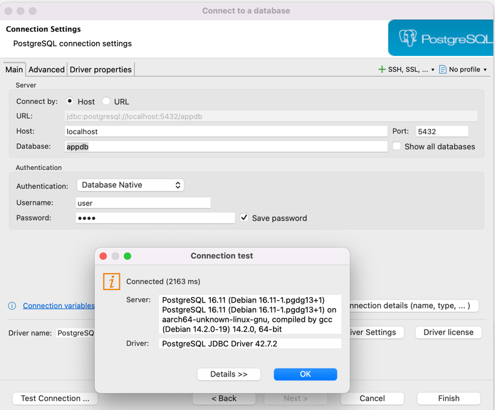

# Inbox / Outbox with Kafka - Spring Boot Java 25

Este projeto demonstra uma arquitetura real de microserviços usando:

- Java 25
- Spring Boot 3.x
- Apache Kafka
- PostgreSQL
- Docker Compose
- Padrões Inbox / Outbox / Unit of Work

## Arquitetura

order-service produz eventos de forma transacional (Outbox Pattern)  
notification-service consome eventos de forma idempotente (Inbox Pattern)

## Como subir

docker-compose up --build

## Teste

POST http://localhost:8080/orders

Verifique:
- Tabela outbox (orderdb)
- Tabela inbox (notificationdb)
- Logs dos serviços

## Benefícios

- Consistência transacional
- Idempotência
- Event-driven real
- Zero risco de perda de mensagens
- Base para sistemas financeiros

## Padrões aplicados

- Unit of Work
- Outbox Pattern
- Inbox Pattern
- Event-driven architecture

## Casos reais

Arquitetura inspirada em práticas de:
Netflix, Uber, iFood, Amazon, Stripe

## Rodando
- docker-compose up --build
- curl -X POST "http://localhost:8080/orders?customer=Diego"
- select * from outbox;
  select * from inbox;

## Conectando bando de dados

## Inbox e Outbox

### Inbox = receber mensagens de forma confiável (evita perder ou duplicar processamento)
### Outbox = enviar mensagens de forma confiável (garante consistência entre banco e eventos)

- Ambos resolvem o problema de consistência eventual em arquiteturas distribuídas, garantindo que mensagens não se percam mesmo em caso de falhas.
- Quer que eu explique algum cenário específico onde você usaria esses padrões?